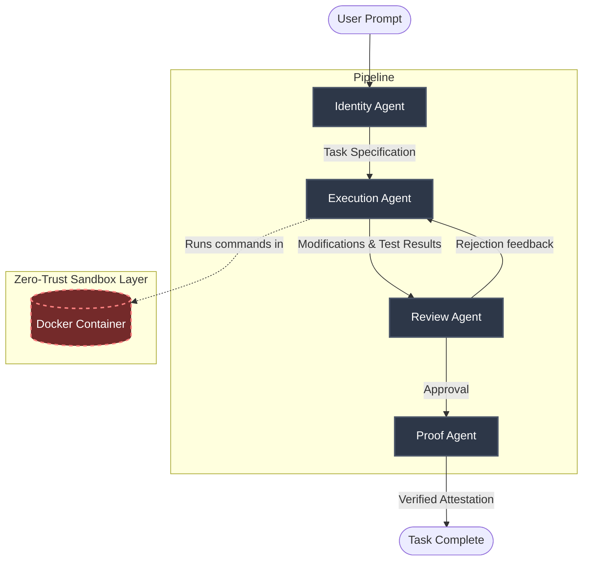

<div align="center">
  <h1>🛡️ AgentForge</h1>
  <p><strong>Autonomous AI Agent Pipeline for Isolated, Auditable Code Execution</strong></p>

  <p>
    <a href="https://github.com/vansh070605/AgentForge/actions/workflows/ci.yml"></a>
    <a href="https://github.com/vansh070605/AgentForge/actions/workflows/security_scan.yml"></a>
    <a href="LICENSE"></a>
  </p>
</div>

---

**AgentForge** is an advanced orchestration framework that delegates complex software development tasks to a multi-agent pipeline. It guarantees that AI-generated code is strictly evaluated, reviewed, and tested inside an **ephemeral, mathematically constrained, and network-isolated Docker sandbox**.

Whether you are building autonomous coding assistants or secure CI/CD agentic workflows, AgentForge ensures that untrusted AI outputs cannot break out, exfiltrate data, or compromise your host infrastructure.

---

## 🏗️ Architecture: The Multi-Agent Pipeline

AgentForge operates on a deterministic state machine managed by the `Orchestrator`. Tasks pass through a strict sequence of specialized agents.



### 1. Identity Agent
Translates ambiguous user requests into a rigorous, verifiable **Task Specification**. It infers required files, scopes the boundaries of the task, and sets the acceptance criteria.

### 2. Execution Agent
The worker. It uses a constrained set of tools (via `ToolRegistry`) to read files, write code, and run tests. **Crucially, it has no direct OS access.** All execution commands are delegated to the `WorkspaceManager`, which routes them into the Sandbox.

### 3. Review Agent
The security and quality gatekeeper. It inspects the `ExecutionAgent`'s diffs and test results. It looks for hardcoded secrets, dangerous `eval()` calls, syntax errors, and scope creep. If the code fails review, it sends feedback back to the Execution Agent to try again.

### 4. Proof Agent
The final auditor. It cryptographically or logically verifies that the implementation meets the original specification and that all tests genuinely pass, issuing a final attestation.

---

## 🔒 Security & Sandbox Isolation

Security is the foundational principle of AgentForge. Execution tools cannot run arbitrary subprocesses on the host. Instead, commands are routed to the `SandboxRuntime`.

When `AGENTFORGE_SANDBOX_DRIVER=docker` is set, AgentForge spins up a highly constrained container for execution:

| Security Control | Implementation | Purpose |
| :--- | :--- | :--- |
| **Zero Egress** | `--network none` | Prevents the AI from downloading malicious payloads or exfiltrating host source code. |
| **Immutable RootFS** | `--read-only` | The container filesystem cannot be modified, preventing malware installation. |
| **Ephemeral Scratch** | `tmpfs /tmp (noexec)` | Provides temporary memory for tests, but prevents execution of dropped binaries. |
| **Fork-Bomb Protection** | `--pids-limit 100` | Prevents malicious or buggy code from exhausting host process tables. |
| **Resource Quotas** | `--cpus 2`, `--memory 2g` | Hard limits on compute resources to prevent denial of service. |
| **Least Privilege** | `--user nobody` | Code executes as an unprivileged user inside the container. |
| **Kernel Hardening** | `--cap-drop ALL`, `no-new-privileges` | Drops all Linux capabilities to prevent privilege escalation or container breakouts. |

*(For CI pipelines or local rapid testing, a `local` fallback driver is available which scrubs environment variables and enforces timeouts without requiring the Docker daemon).*

---

## ✨ Key Features

- **FastAPI + Server-Sent Events (SSE)**: Real-time, granular telemetry of the agent pipeline. Connect a frontend and watch the agents think, execute, and review in real-time.
- **Immutable Audit Trails**: Every tool invocation, file read, file write, and command execution is logged with exact timestamps and parameters.
- **Deterministic Tooling**: Agents interface with the repo exclusively through strict, validated Python interfaces (`WorkspaceManager`), preventing arbitrary path traversal (`../../`).
- **React Frontend Integration**: Includes a modern web interface for observing the pipeline, viewing diffs, and reading audit logs.

---

## 🚀 Getting Started

### Prerequisites
- Python 3.11 or 3.12
- Docker Engine (v24+) running locally
- Git

### Installation

```bash
# Clone the repository
git clone https://github.com/vansh070605/AgentForge.git
cd AgentForge/backend

# Install the package with dependencies
pip install -e ".[dev,sandbox]"
```

### Running the API Server

Start the FastAPI orchestrator backend:

```bash
# Enable production Docker sandbox
export AGENTFORGE_SANDBOX_DRIVER=docker

# Start the server (runs on http://localhost:8000)
cd backend
uvicorn agentforge.api:app --reload
```

### Running the Frontend UI

```bash
cd frontend
npm install
npm run dev
```

---

## 🧪 Testing

AgentForge is heavily tested, separating unit logic from Docker integration.

```bash
cd backend

# Run unit tests (uses LocalSubprocessRuntime, no Docker needed)
pytest tests/ -m "not requires_docker"

# Run Sandbox Integration tests (requires Docker daemon)
pytest tests/test_sandbox_docker.py -m requires_docker
```

---

## 📖 Governance & Contribution

We welcome contributions! Please review our community guidelines before submitting pull requests.

- [**Contributing Guide**](CONTRIBUTING.md): Instructions for setting up your dev environment and submitting PRs.
- [**Security Policy**](SECURITY.md): How to responsibly report vulnerabilities.
- [**Code of Conduct**](CODE_OF_CONDUCT.md): Our expectations for community interaction.

---

## 📄 License

This project is licensed under the **MIT License** - see the [LICENSE](LICENSE) file for details.
